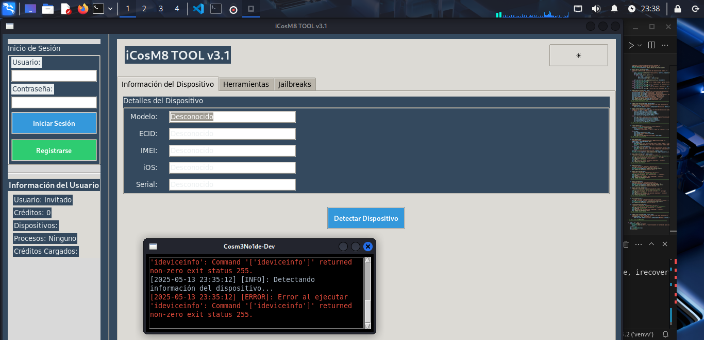

# iCosM8 Bypass Tool

## Descripción del Proyecto
iCosM8 Bypass Tool es una herramienta diseñada para detectar vulnerabilidades checkm8 en dispositivos iOS y facilitar el proceso de jailbreak y bypass de ciertas restricciones.

Esta herramienta busca simplificar el proceso de detección de dispositivos vulnerables, ejecución de exploits, y realización de jailbreak/bypass para usuarios con conocimientos técnicos.

Advertencia: El uso de esta herramienta puede tener implicaciones legales y debe realizarse únicamente en dispositivos de tu propiedad o con el consentimiento explícito del propietario. El desarrollador no se hace responsable del uso indebido de esta herramienta.

Características Principales
Detección de Vulnerabilidades checkm8: La herramienta identifica dispositivos Apple vulnerables al exploit checkm8 al detectar si el dispositivo está en modo DFU y verificar la compatibilidad del hardware con el exploit.

Ejecución de checkm8: iCosM8 simplifica la ejecución del exploit checkm8 al automatizar el envío de payloads necesarios a través de una interfaz gráfica, eliminando la necesidad de utilizar la línea de comandos directamente.

Bypass de Passcode (Opcional): Permite eludir la pantalla de bloqueo del código de acceso en dispositivos iOS vulnerables, facilitando el acceso al sistema de archivos. Esta función está limitada a ciertos dispositivos y versiones de iOS y puede requerir pasos adicionales.

Bypass Hello Screen (Opcional): Permite omitir la pantalla de "Hola" en dispositivos iOS activados, lo que puede ser útil en ciertas situaciones de reparación o recuperación de datos. Esta función tiene limitaciones en cuanto a los dispositivos y las versiones de iOS compatibles, y su efectividad puede variar.

Interfaz Gráfica Intuitiva: La herramienta cuenta con una interfaz gráfica fácil de usar, que incluye botones para iniciar la detección y la explotación, indicadores de progreso para mostrar el estado del proceso y un área de salida de texto para mostrar información detallada.

Salida Detallada: iCosM8 proporciona información detallada del proceso de explotación en un área de texto, mostrando la salida estándar y los mensajes de error de la herramienta subyacente para facilitar la resolución de problemas.

Soporte para Linux: La herramienta está diseñada principalmente para el sistema operativo Linux.

###cosm3No1de.dev
